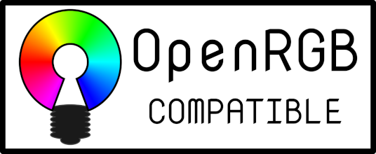
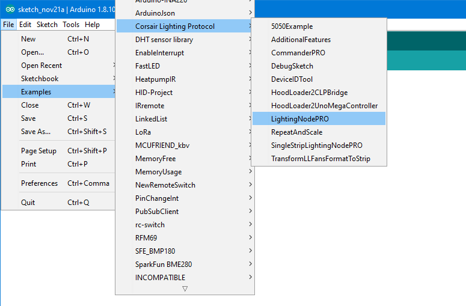
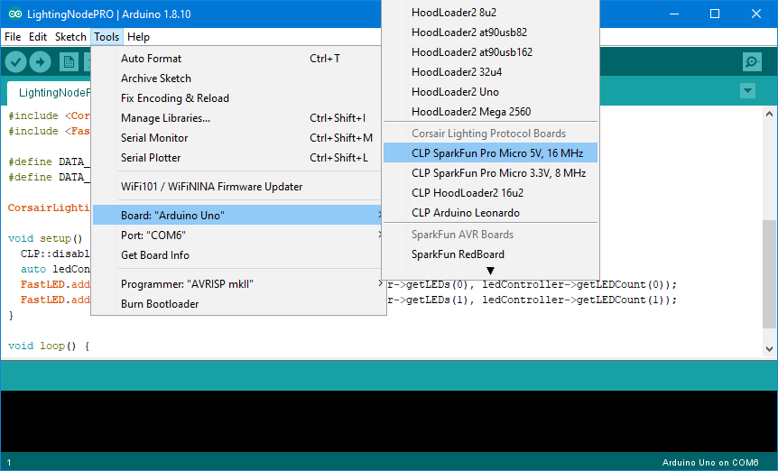
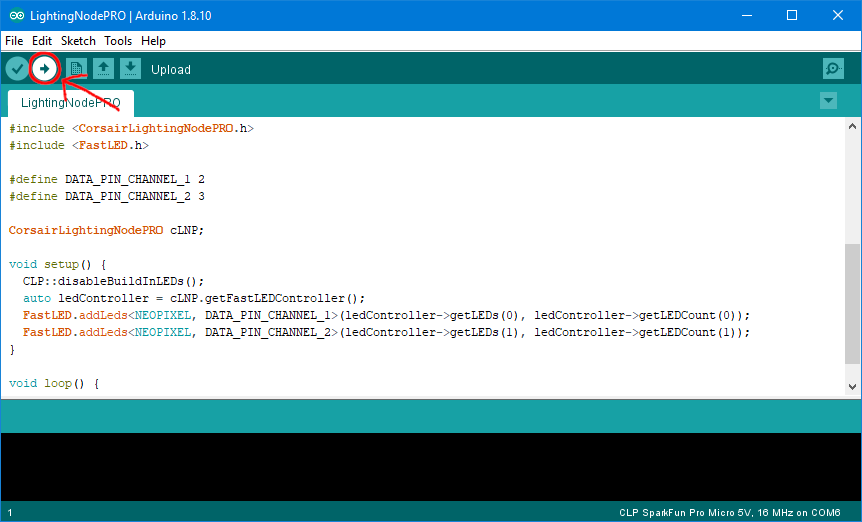
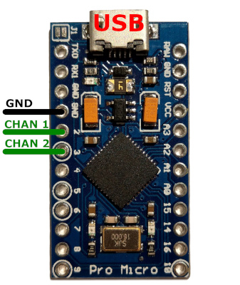
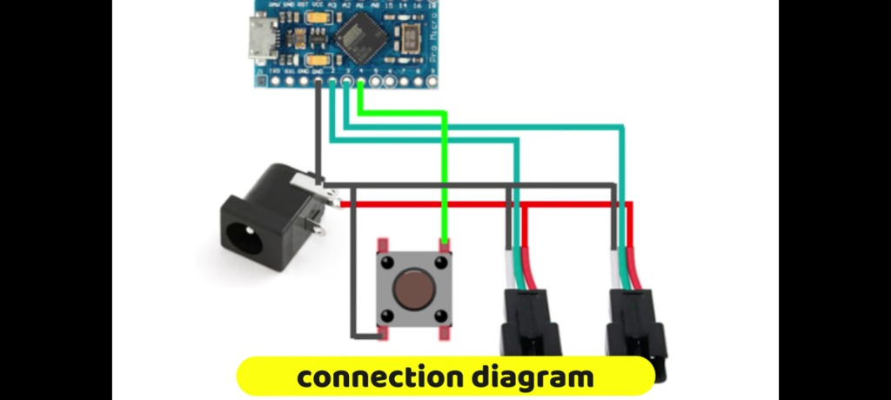
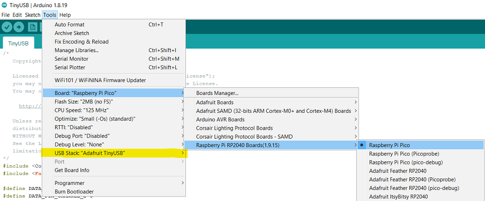
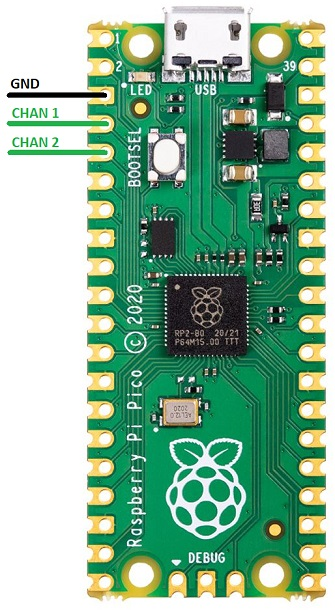
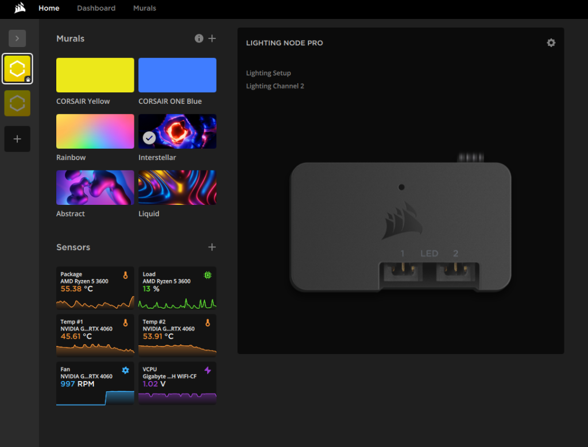
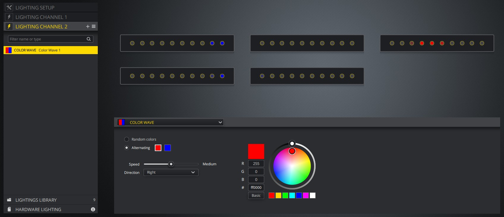

# Corsair Lighting Protocol [](https://www.ardu-badge.com/Corsair%20Lighting%20Protocol) [](https://github.com/MasterJi27/CorsairLightingProtocol/actions?query=workflow%3ATest+branch%3Amain+event%3Apush)

<a href="https://www.corsair.com/icue"></a>
<a href="https://rgbsync.com/"></a>
<a href="https://gitlab.com/CalcProgrammer1/OpenRGB"></a>
<a href="https://signalrgb.com"></a>


**This library can be used to integrate custom/unofficial RGB strips with iCUE.**
_This is not an official Corsair project._

## Features
* Add support of Corsair DIY device protocol to Arduino.
* Control LEDs with the [Corsair iCUE software](https://www.corsair.com/icue).
* [Support common LED chipsets](https://github.com/FastLED/FastLED/wiki/Overview#chipsets). (e.g. WS2812B, WS2801)
* Support [FastLED](http://fastled.io/).
* Supported platforms: Arduino AVR, [TinyUSB supported cores](https://github.com/adafruit/Adafruit_TinyUSB_Arduino#supported-cores)
* Hardware Lighting mode.
* Use multiple devices at the same time.
* Repeat or scale LED channels to arbitrary size.

### Supported Devices
* Lighting Node PRO
* Commander PRO
* Lighting Node CORE
* LS100 Smart Lighting Controller
* LT100 Smart Lighting Towers


# Getting started
This project is an Arduino library called "Corsair Lighting Protocol".
It can be used to control Arduino boards with iCUE.
This project provides example sketches for easy use with Arduino IDE.

- [Requirements](#requirements)
- [Install the libraries](#install-the-libraries)
- [Create a Lighting Node PRO with AVR](#create-a-lighting-node-pro-with-avr)
- [Create a Lighting Node PRO with TinyUSB](#create-a-lighting-node-pro-for-a-raspberry-pi-pico-with-tinyusb)
- [Use the Lighting Node PRO](#use-the-lighting-node-pro)

## Requirements
The library is compatible with all boards using the MCU ATmega32U4.
This includes **Arduino Leonardo**, **SparkFun Pro Micro**, **Arduino Micro**, and **Adafruit 32u4 AVR Boards**.
It also supports the Arduino Uno and Arduino Mega, **but** this requires the [HoodLoader2](https://github.com/NicoHood/HoodLoader2) bootloader, see [this wiki](https://github.com/MasterJi27/CorsairLightingProtocol/wiki/How-to-use-on-Arduino-Uno-and-Arduino-Mega) for more details.

In addition, any board compatible with **Adafruit TinyUSB for Arduino** is also supported without the use of custom board definitions. Be sure to define USE_TINYUSB, which is done automatically when using a supported core and selecting TinyUSB for the USB Stack. See the TinyUSB example for implementation details.

It is **not** compatible with ATmega328 (Arduino Nano), STM8S103F3, teensy, or ESP8266 see [list of architecture/platform](https://github.com/MasterJi27/CorsairLightingProtocol/issues?q=is%3Aissue+label%3Aarchitecture%2Fplatform) for a detailed description why they are not supported.

In the rest of the documentation "Arduino" is used as a synonym for all supported boards regardless of the manufacturer.

When you have problems with a board not listed here, please open an [Issue](https://github.com/MasterJi27/CorsairLightingProtocol/issues).

## Install the libraries
To use this library you must install it with the Library-Manager.
Open the Library-Manager in Arduino IDE via Tools->Manage Libraries...
Search for "Corsair Lighting Protocol" and install the Corsair Lighting Protocol library.
This library also requires the [FastLED](http://fastled.io/) library.
Search for "FastLED" in the Library-Manager and install the FastLED library.
If using TinyUSB, also install the latest "Adafruit TinyUSB Library" as it supersedes some of the core versions.

## Create a Lighting Node PRO with AVR
This guide will teach you how to create a Lighting Node PRO with an Arduino Leonardo compatible board.
If you have an Arduino Uno or Mega, see the [other guide](https://github.com/MasterJi27/CorsairLightingProtocol/wiki/How-to-use-on-Arduino-Uno-and-Arduino-Mega).

1. Open the example "LightingNodePRO", you can find it in Arduino IDE in the File menu->Examples->Corsair Lighting Protocol->LightingNodePRO.
   If you can't open the LightingNodePRO example the Corsair Lighting Protocol library is not installed correctly.

   
1. Install the [CLP Boards](https://github.com/MasterJi27/CorsairLightingProtocolBoards).
   They can be installed by following the [CLP Boards installation guide](https://github.com/MasterJi27/CorsairLightingProtocolBoards#how-to-use-these-boards-in-arduino).
   After installation it should be possible to select the CLP Boards in the Arduino IDE as shown in the screenshot below.
   If your are using a Sparkfun Pro Micro also install the [SparkFun Boards definition](https://github.com/sparkfun/Arduino_Boards#installation-instructions).

   
1. Upload the "LightingNodePRO" sketch to your Arduino.

   
1. Do the wiring.
   For more information on [how to wire the LEDs](https://github.com/FastLED/FastLED/wiki/Wiring-leds) and [how to set up the LEDs in the code](https://github.com/FastLED/FastLED/wiki/Basic-usage#setting-up-the-leds) see the links.
   
   
   

   #### Connection Diagram Details:
   * **Pro Micro / Leonardo (ATmega32U4):** Serves as the microcontroller that acts as a USB HID device, mimicking the Corsair Lighting Node PRO.
   * **DC Barrel Jack (External 5V Power Supply):** Supplies the direct 5V current needed by the LED strips. Powering addressable LEDs (like WS2812B) directly from the Arduino/Pro Micro 5V pin or your PC's USB port will damage the board or trigger USB port overcurrent protection.
   * **Pin 2 Pushbutton:** Connects Pin 2 to GND. An optional switch useful for custom hardware trigger profiles or reset mechanisms.
   * **3-pin LED Connectors:** Standard JST-SM (or similar) connectors carrying:
     * **VCC (5V):** Connected directly to the external 5V power supply.
     * **Data:** Hooked to the Pro Micro's LED channel pins (e.g. Pin 3 and Pin 7) through a 220Ω–470Ω protective resistor.
     * **GND:** Connected to the common ground rail.

   > [!IMPORTANT]
   > **Critical Wiring Rules:**
   > * **Common Ground:** Ensure the ground (`GND`) of the external 5V power supply, the Arduino Pro Micro, and the LED strips are all tied together. Failing to do so causes signal noise, data corruption, and flickering.
   > * **Isolate Power Rails:** Do not connect the external 5V rail directly to the Arduino's 5V/VCC pin while the Arduino is powered by the USB connection. Keep them isolated (power Arduino via USB, power LEDs via external supply) to prevent reverse current from damaging your computer's USB port.

1. Verify your device works as expected.
   Open the Windows settings->devices->Other devices.
   Somewhere in the list of devices, there should be a device called "Lighting Node PRO".
1. Now open [iCUE](https://www.corsair.com/icue) there you should see the "Lighting Node PRO".

> [!NOTE]
> If you have any problems during setup, you may find the solution in the [Troubleshooting section](https://github.com/MasterJi27/CorsairLightingProtocol/wiki/Troubleshooting).

## Create a Lighting Node PRO for a Raspberry Pi Pico with TinyUSB

This guide will teach you how to create a Lighting Node PRO with a Raspberry Pi Pico.

> [!WARNING]
> FastLED currently does not support the RP2040 natively in older releases. You must manually merge support by modifying your library to include the [6 RP2040 platform files](https://github.com/FastLED/FastLED/pull/1261/files#diff-fda1710ad90fcc4b2f07be21a834da7d24b00008867655232c84fb0369cfc74b) in the `FastLED/src/platforms/arm/rp2040` folder and `#elif defined(ARDUINO_ARCH_RP2040)` / `#include` statements in [led_sysdefs.h](https://github.com/FastLED/FastLED/pull/1261/files#diff-95f6b43a0e6b0e58988e1be3bc6415ded5284082a4f2ce2aaa90f5931d4194af) and [platforms.h](https://github.com/FastLED/FastLED/pull/1261/files#diff-255ea38a6573ed237ea1fe164d5e87ca46811eef21ba6e2cef120fda47c6e62f).

1. Install the [Raspberry Pi Pico Arduino core](https://github.com/earlephilhower/arduino-pico#installing-via-arduino-boards-manager).

1. Open the example "TinyUSB", you can find it in Arduino IDE in the File menu->Examples->Corsair Lighting Protocol->TinyUSB.
   If you can't open the LightingNodePRO example the Corsair Lighting Protocol library is not installed correctly.

1. Select the Raspberry Pi Pico as shown in the screenshot below. Be sure to select the "Adafruit TinyUSB" USB Stack.

   
1. Upload the "TinyUSB" sketch to your Pico.

1. Do the wiring.
   For more information on [how to wire the LEDs](https://github.com/FastLED/FastLED/wiki/Wiring-leds) and [how to set up the LEDs in the code](https://github.com/FastLED/FastLED/wiki/Basic-usage#setting-up-the-leds) see the links.

   > [!TIP]
   > A level shifter or buffer, like [this SN74AHCT1G126](https://www.ti.com/product/SN74AHCT1G126), is highly recommended in between the Pico and the LEDs to translate the 3.3V logic level of the Pico IO to the 5V logic level of the LEDs. Your setup may not work reliably without one.
   
   
1. Verify your device works as expected.
   Open the Windows settings->devices->Other devices.
   Somewhere in the list of devices, there should be a device called "Lighting Node PRO".
1. Now open [iCUE](https://www.corsair.com/icue) there you should see the "Lighting Node PRO".

## Use the Lighting Node PRO

Once configured, open Corsair iCUE. Your custom Arduino board will display as a **Lighting Node PRO**!

### Sample iCUE Dashboard


### Lighting Channels Setup


In iCUE, open the **Lighting Setup** tab of the Lighting Node PRO (LNP) and set the device type for both Lighting Channels to **RGB Light Strip**. Set the amount to a tenth of the LEDs you have (since iCUE groups LEDs into groups of ten).
For example, if you have 20 LEDs, set the amount to `2`.
Now you can create custom lighting effects in the **Lighting Channel #** tabs.

# Documentation

- [API Documentation](https://masterji27.github.io/CorsairLightingProtocol/)
- [How it works](#how-it-works)
- [Use of multiple devices](#use-of-multiple-devices)
- [Create a Commander PRO (Fans & Temperature)](#create-a-commander-pro-fans-temperature)
- [Connect Multiple Fans without a Corsair RGB Fan Hub](#connect-multiple-fans-without-a-corsair-rgb-fan-hub)
- [Control Non-Addressable (Analog) RGB Strips](#control-non-addressable-analog-rgb-strips)
- [Ambient Backlighting (LS100/LT100 Emulation)](#ambient-backlighting-ls100lt100-emulation)
- [Disabling EEPROM (Wear Prevention)](#disabling-eeprom-wear-prevention)
- [Using HoodLoader2 (Arduino Uno & Mega)](#using-hoodloader2-arduino-uno--mega)
- [Repeat or scale LED channels](#repeat-or-scale-led-channels)
- [Increase the Brightness of the LEDs](#increase-the-brightness-of-the-leds)
- [Reverse direction of LED Strip](#reverse-direction-of-led-strip)
- [Hardware Lighting mode](#hardware-lighting-mode)

## How it works
This library uses the USB HID interface of the ATmega32U4.
After uploading a sketch with the library and selected CLP Boards, iCUE recognizes the Arduino as a Corsair device, because the CLP Boards use USB IDs of Corsair.
In iCUE you can then select the device and set some lighting effects.
iCUE sends these via the HID protocol to the Arduino.
These commands are understood by the library and converted into lighting effects on the RGB strips connected to the Arduino.
The [FastLED](http://fastled.io/) library is used to control the LEDs.

## Use of multiple devices
Each device has two unique IDs, that is, they should be unique.
You must give each device a unique ID.
There are two IDs that must be changed `Serial Number` and `DeviceID`.

The Serial Number can be set in the constructor of `CorsairLightingProtocolHID` and `CLPUSBSerialBridge` as shown in the [example](examples/AdditionalFeatures/AdditionalFeatures.ino).
```C++
const char mySerialNumber[] PROGMEM = "202B6949A967";
CorsairLightingProtocolHID cHID(&cLP, mySerialNumber);
```
The Serial Number MAY only consist of HEX characters (0-9 and A-F).

The DeviceID can be set with the `setDeviceID` function of `CorsairLightingFirmware`.
```C++
void setup() {
    DeviceID deviceId = { 0x9A, 0xDA, 0xA7, 0x8E };
    firmware.setDeviceID(deviceId);
    ...
}
```

### Alternative
The `DeviceID` can be changed with the [DeviceIDTool](examples/DeviceIDTool/DeviceIDTool.ino).
Upload the DeviceIDTool sketch and then open the Serial monitor with baudrate 115200.
The tool displays the current DeviceID, you can type in a new DeviceID that is saved on the Arduino.
After that, you can upload another sketch.

## Create a Commander PRO (Fans & Temperature)
The library can emulate a **Corsair Commander PRO**, allowing you to control PWM PC fans and read analog temperature sensors (thermistors) directly inside iCUE.

To emulate a Commander PRO:
1. Initialize the firmware constructor with the device type `CORSAIR_COMMANDER_PRO`.
2. Instantiate `ThermistorTemperatureController` and `SimpleFanController` helper classes.
3. Pass them to the `CorsairLightingProtocolController` configuration.

Here is a simplified configuration example based on [CommanderPRO.ino](examples/CommanderPRO/CommanderPRO.ino):

```C++
#include <CorsairLightingProtocol.h>
#include <FastLED.h>
#include "SimpleFanController.h"
#include "ThermistorTemperatureController.h"

#define DATA_PIN_CHANNEL_1 2
#define DATA_PIN_CHANNEL_2 3
#define TEMP_SENSOR_PIN_1  A6
#define PWM_FAN_PIN_1      5

#define CHANNEL_LED_COUNT  96

CorsairLightingFirmwareStorageEEPROM firmwareStorage;
// Emulate Commander PRO instead of Lighting Node PRO
CorsairLightingFirmware firmware(CORSAIR_COMMANDER_PRO, &firmwareStorage);

ThermistorTemperatureController temperatureController;
FastLEDControllerStorageEEPROM storage;
FastLEDController ledController(&storage);
SimpleFanController fanController(&temperatureController, 500, EEPROM_ADDRESS + storage.getEEPROMSize());

CorsairLightingProtocolController cLP(&ledController, &temperatureController, &fanController, &firmware);
CorsairLightingProtocolHID cHID(&cLP);

CRGB ledsChannel1[CHANNEL_LED_COUNT];
CRGB ledsChannel2[CHANNEL_LED_COUNT];

PWMFan fan1(PWM_FAN_PIN_1, 0, 2000); // pin, tacho Pin (0 for none), max RPM

void setup() {
    FastLED.addLeds<WS2812B, DATA_PIN_CHANNEL_1, GRB>(ledsChannel1, CHANNEL_LED_COUNT);
    FastLED.addLeds<WS2812B, DATA_PIN_CHANNEL_2, GRB>(ledsChannel2, CHANNEL_LED_COUNT);
    ledController.addLEDs(0, ledsChannel1, CHANNEL_LED_COUNT);
    ledController.addLEDs(1, ledsChannel2, CHANNEL_LED_COUNT);

    // Register 10k Ohm NTC temperature sensor
    temperatureController.addSensor(0, TEMP_SENSOR_PIN_1);
    
    // Register PWM fan
    fanController.addFan(0, &fan1);
}

void loop() {
    cHID.update();
    if (ledController.updateLEDs()) {
        FastLED.show();
    }
    fanController.updateFans();
}
```

> [!TIP]
> Standard NTC 10k Ohm thermistors are ideal for monitoring liquid, intake, or ambient temperatures. Place them in your cooling loop or case, register them in your code, and customize fan speeds inside iCUE based on these readings.

## Connect Multiple Fans without a Corsair RGB Fan Hub
Normally, Corsair RGB fans must be plugged into a proprietary RGB Fan LED Hub. However, using this library, you can connect each fan's RGB data line to **separate digital pins** on your Arduino (e.g. Pin 2, Pin 3, Pin 4...) and map them to a single virtual LED channel in iCUE.

This avoids the need for a physical hardware hub!

Example setup based on [MultipleFans.ino](examples/MultipleFans/MultipleFans.ino):

```C++
#define NUMBER_OF_LEDS_PER_FAN 8 // E.g., SP120 RGB has 8 LEDs per fan

#define DATA_PIN_FAN_1 2
#define DATA_PIN_FAN_2 3
#define DATA_PIN_FAN_3 4

CRGB ledsChannel1[24]; // 3 fans * 8 LEDs = 24 LEDs total

void setup() {
    // Distribute fan data lines onto separate pins but share the same virtual CRGB array:
    FastLED.addLeds<WS2812B, DATA_PIN_FAN_1, GRB>(ledsChannel1, NUMBER_OF_LEDS_PER_FAN * 0, NUMBER_OF_LEDS_PER_FAN);
    FastLED.addLeds<WS2812B, DATA_PIN_FAN_2, GRB>(ledsChannel1, NUMBER_OF_LEDS_PER_FAN * 1, NUMBER_OF_LEDS_PER_FAN);
    FastLED.addLeds<WS2812B, DATA_PIN_FAN_3, GRB>(ledsChannel1, NUMBER_OF_LEDS_PER_FAN * 2, NUMBER_OF_LEDS_PER_FAN);

    ledController.addLEDs(0, ledsChannel1, 24);
}
```

## Control Non-Addressable (Analog) RGB Strips
If you have standard 4-pin 12V or 5V analog RGB strips, you can still control them via iCUE. The library can be configured to take the color of the first LED of a virtual channel and output it to Arduino PWM pins connected to RGB drive transistors (like N-channel MOSFETs).

Example setup based on [NonAddressable.ino](examples/NonAddressable/NonAddressable.ino):

```C++
#define RED_PIN 3
#define GREEN_PIN 5
#define BLUE_PIN 6

CRGB ledsChannel1[10];

void setup() {
    pinMode(RED_PIN, OUTPUT);
    pinMode(GREEN_PIN, OUTPUT);
    pinMode(BLUE_PIN, OUTPUT);

    ledController.addLEDs(0, ledsChannel1, 10);
    
    // Intercept update event and mirror the first LED's color to the PWM pins
    ledController.onUpdateHook(0, []() {
        analogWrite(RED_PIN, ledsChannel1[0].r);
        analogWrite(GREEN_PIN, ledsChannel1[0].g);
        analogWrite(BLUE_PIN, ledsChannel1[0].b);
    });
}
```

## Ambient Backlighting (LS100/LT100 Emulation)
You can configure the library to emulate a **Corsair Smart Lighting Controller** (LS100/LT100). This is particularly useful for monitor backlighting or ambient lighting setups that sync dynamically with screen colors inside iCUE.

Example setup based on [AmbientBacklight.ino](examples/AmbientBacklight/AmbientBacklight.ino):

```C++
#include <CorsairLightingProtocol.h>
#include <FastLED.h>

#define DATA_PIN_CHANNEL_1 2
#define DATA_PIN_CHANNEL_2 3

CRGB ledsChannel1[84];
CRGB ledsChannel2[105];

CorsairLightingFirmwareStorageEEPROM firmwareStorage;
// Emulate LS100/LT100 Smart Lighting Controller
CorsairLightingFirmware firmware(CORSAIR_SMART_LIGHTING_CONTROLLER, &firmwareStorage);

FastLEDControllerStorageEEPROM storage;
FastLEDController ledController(&storage);
CorsairLightingProtocolController cLP(&ledController, &firmware);
CorsairLightingProtocolHID cHID(&cLP);

void setup() {
    FastLED.addLeds<WS2812B, DATA_PIN_CHANNEL_1, GRB>(ledsChannel1, 84);
    FastLED.addLeds<WS2812B, DATA_PIN_CHANNEL_2, GRB>(ledsChannel2, 105);
    ledController.addLEDs(0, ledsChannel1, 84);
    ledController.addLEDs(1, ledsChannel2, 105);

    // Apply optimizations in the update hook:
    ledController.onUpdateHook(0, []() {
        // 1. Fix the iCUE 50% brightness limitation for ambient lighting
        CLP::fixIcueBrightness(&ledController, 0);
        // 2. Apply gamma correction for accurate screen-to-LED color matching
        CLP::gammaCorrection(&ledController, 0);
    });
}

void loop() {
    cHID.update();
    if (ledController.updateLEDs()) {
        FastLED.show();
    }
}
```

> [!NOTE]
> Under LS100/LT100, iCUE restricts the LED brightness to a maximum of 50% for eye safety. The `CLP::fixIcueBrightness` utility scales the output back to 100% so you can utilize your LEDs' full brightness.

## Disabling EEPROM (Wear Prevention)
By default, the library stores active lighting profiles and custom device IDs inside the Arduino's non-volatile EEPROM. If you want to prevent EEPROM write wear or are running on a board that lacks native EEPROM (like the Raspberry Pi Pico), you can configure the library to use static in-memory storage.

Example setup based on [NoEEPROM.ino](examples/NoEEPROM/NoEEPROM.ino):

```C++
#include <CorsairLightingProtocol.h>
#include <FastLED.h>

#define DATA_PIN_CHANNEL_1 2

CRGB ledsChannel1[96];

// Use static firmware storage instead of EEPROM storage
DeviceID deviceID = {0x9A, 0xDA, 0xA7, 0x8E};
CorsairLightingFirmwareStorageStatic firmwareStorage(deviceID);
CorsairLightingFirmware firmware(CORSAIR_LIGHTING_NODE_PRO, &firmwareStorage);

// Pass nullptr to FastLEDController to disable EEPROM profile saving
FastLEDController ledController(nullptr);
CorsairLightingProtocolController cLP(&ledController, &firmware);
CorsairLightingProtocolHID cHID(&cLP);

void setup() {
    FastLED.addLeds<WS2812B, DATA_PIN_CHANNEL_1, GRB>(ledsChannel1, 96);
    ledController.addLEDs(0, ledsChannel1, 96);
}

void loop() {
    cHID.update();
    if (ledController.updateLEDs()) {
        FastLED.show();
    }
}
```

## Using HoodLoader2 (Arduino Uno & Mega)
Because the **Arduino Uno** and **Arduino Mega** do not use an ATmega32U4 as their main processor, they cannot natively act as USB HID devices. However, you can still use them with this library by taking advantage of the secondary **ATmega16U2** (or ATmega8U2) chip on the board.

This requires flashing the ATmega16U2 with the **HoodLoader2** bootloader.

### System Architecture:
1. **ATmega16U2 (USB Bridge)**: Runs the [HoodLoader2CLPBridge.ino](examples/HoodLoader2CLPBridge/HoodLoader2CLPBridge.ino) sketch. It acts as the USB HID device for iCUE, captures USB lighting packets, and forwards them over Serial to the main MCU.
2. **ATmega328P / ATmega2560 (Main Controller)**: Runs the [HoodLoader2UnoMegaController.ino](examples/HoodLoader2UnoMegaController/HoodLoader2UnoMegaController.ino) sketch. It reads lighting data from Serial and drives the physical LED strips.

```
+------------+       USB       +---------------+       Serial      +------------------+
|     PC     | --------------> |  ATmega16U2   | ----------------> | ATmega328P/2560  |
|  (iCUE)    |                 | (USB Bridge)  | (Pins 0/1 Rx/Tx)  | (LED Driver)     |
+------------+                 +---------------+                   +------------------+
                                                                            |
                                                                            v
                                                                     Addressable LEDs
```

> [!IMPORTANT]
> Refer to the [HoodLoader2 Wiki Guide](https://github.com/MasterJi27/CorsairLightingProtocol/wiki/How-to-use-on-Arduino-Uno-and-Arduino-Mega) for step-by-step instructions on flashing the ATmega16U2 bootloader.

## Repeat or scale LED channels
You can repeat or scale LED channel controlled by iCUE onto physical LED strips.
This is very useful if you have very long LED strips that are longer than 60/96/135 LEDs, which is the maximum number iCUE supports.

To repeat or scale a LED channel you must apply the `CLP::repeat` or the `CLP:scale` function in the update hook of the FastLEDController.
See the [RepeatAndScale](examples/RepeatAndScale/RepeatAndScale.ino) example for the complete code.
Both functions take the FastLEDController pointer and the channel index as arguments.
Additionally, the `repeat` function takes as an argument how often the LED channel should be repeated.
For example, if you want to duplicate the channel you must pass `2` as argument.
The `scale` function takes as third argument the length of the physical LED strip to which it scales the channel using integer scaling.
For example you have 144 physical LEDs on you strip and 60 on the LED channel.
Then the third argument of the `scale` function is `144`.

For both functions it's **important**, that the CRGB arrays have at least the length of the physical LED strip.
This means if your LED channel from iCUE has 50 LEDs and you use the `repeat` function to control 100 physical LEDs you MUST declare the CRGB array at least with a length of 100.

## Increase the Brightness of the LEDs
When using LS100 or LT100 iCUE only uses 50% of the LEDs brightness even if you set the brightness to max in the iCUE Device Settings.
But there are good news, we can increase the brightness with the Arduino so we can use the full brightness of our LEDs.
Add the `CLP::fixIcueBrightness` function to the `onUpdateHook` in the setup function as shown in the [example](examples/AmbientBacklight/AmbientBacklight.ino).
If there are multiple functions called in `onUpdateHook`, `fixIcueBrightness` should be the first.
Only use this function with LS100 and LT100 devices!
```C++
ledController.onUpdateHook(0, []() {
	CLP::fixIcueBrightness(&ledController, 0);
});
```

## Reverse direction of LED Strip
If you want to change the direction of the LEDs of the Strip without physically change the strip, the `CLP::reverse` function can be used.
The reverse function must be called be for scaling.
```C++
ledController.onUpdateHook(0, []() {
	CLP::reverse(&ledController, 0);
});
```
## Hardware Lighting mode
The [Hardware Lighting mode](https://forum.corsair.com/v3/showthread.php?t=182874) can be configured in iCUE.
It allows you the set lighting effects that will be active when iCUE **is not** running.
This is the case when the PC is off, in sleep mode, booting or the user is logged out.
So if you want to have lighting effects in all these situations, use the Hardware Lighting mode.
If you don't want it, configure a static black color.

# License
This project is licensed under the Apache 2.0 License.

# DISCLAIMERS
This is a DO IT YOURSELF project, use at your own risk!

# Credits
- [HoodLoader2](https://github.com/NicoHood/HoodLoader2)
- [Arduino HID Project](https://github.com/NicoHood/HID)
- [Protocol Information](https://github.com/audiohacked/OpenCorsairLink/issues/70)

## Related projects
- [CorsairArduinoController](https://github.com/TylerSeiford/CorsairArduinoController)
- [CorsairLightingProtocolBoards](https://github.com/MasterJi27/CorsairLightingProtocolBoards)
- [OpenCorsairLighting](https://github.com/McHauge/OpenCorsairLighting)
